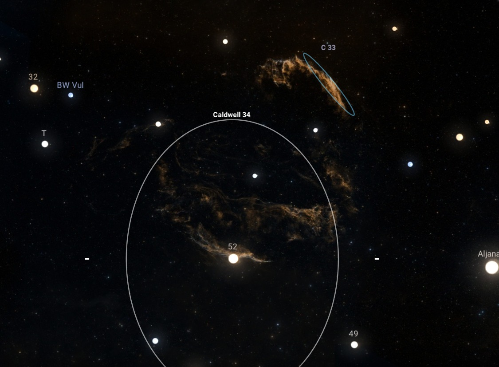

# Astara Features

Astara is built on the Stellarium Web Engine, but extends it significantly to create
a fully functional mobile planetarium app. This document describes everything we
added or changed beyond the base web planetarium.

### Gyroscope Mode

Point your phone at the sky and the view follows. The app reads device orientation
sensors and translates them into sky coordinates in real time.

- Back camera orientation mapped to sky view direction
- Adaptive smoothing prevents jitter while remaining responsive
- Automatic swipe detection to exit gyro mode
- Orientation lock to portrait mode while active

### AR Camera Overlay

Stars and constellations overlaid on the live camera feed. See the real sky through
your camera with celestial labels floating in place.

- Toggle AR mode from the control bar
- Adjustable overlay opacity for visibility in different lighting
- Canvas blending so dark sky becomes transparent
- Camera feed managed by Capacitor for native performance

### Direction Tracking Overlay

Select any object and see a visual guide pointing toward it. The guide updates live
as you move your device, showing both direction and distance in degrees.

- Compass-style arrow toward target
- Distance indicator in degrees
- Works in gyroscope mode and AR mode
- Disappears when target is on screen

### Astronomical Calendar

A built-in calendar of celestial events calculated locally on the device.

**Moon Events**
- New Moon, Full Moon, First Quarter, Last Quarter
- Moonrise and Moonset times
- Lunar perigee and apogee

**Solar Events**
- Equinoxes and Solstices
- Sunrise and Sunset times

**Planetary Events**
- Conjunctions between planets
- Oppositions and elongations

**Eclipses**
- Solar and lunar eclipses

### Offline Operation

The entire app works without network access. All sky data is bundled at build time.

**Bundled Data**
- Hipparcos star catalog (~120,000 stars)
- Deep sky object catalog (galaxies, nebulae, clusters)
- Solar system ephemeris data
- Constellation lines and boundaries
- Milky Way panorama
- Multiple landscape panoramas
- Satellite TLE data
- Comet and asteroid orbits

**No Network Required**
- Location can be set manually
- All calculations performed on device
- No external API calls during normal use

### Enhanced Search

Search across stars, planets, constellations, and deep sky objects with unified
results, optimized for performance on mobile devices.

- Fuzzy matching and prefix matching on object names
- Cross-catalog search (Messier, NGC, common names)
- Results ranked by relevance
- Tap to center and track any result

### Multi-Constellation Sky Cultures

Switch between different cultural interpretations of the night sky.

- IAU/Western constellations
- Indian Nakshatra system
- Chinese sky culture
- Arabic sky culture
- And more bundled with the app

### Deep Sky Object Overlays

HiPS image tiles for deep sky objects, displayed as overlays on the sky view.
Images appear progressively as you zoom in, providing detailed views of galaxies,
nebulae, and clusters at higher magnification levels.

- Toggle overlay visibility from settings
- Images load progressively based on zoom level
- Catalog designations displayed as labels

### Touch-First Interface

UI rebuilt for mobile touch interaction, rather than mouse and keyboard.

- Bottom control bar with quick toggles
- Swipe gestures for navigation
- Pinch to zoom
- Click on object to center and track it and open the info panel
- Long press for menu option selection

### Location Management

Set your observing location with or without GPS.

- Auto-detect via device GPS
- Manual coordinate entry
- Named location presets
- Geocoding for location names
- Fallback to saved location if GPS fails

### Time Control

Jump to any date and time, or watch the sky animate.

- Date and time picker
- Real-time mode (follows actual time)
- Time acceleration controls
- Jump to sunrise, sunset, or specific events

### Selected Object Information

Detailed information panel for any selected object.

- Common and catalog names
- Current position (altitude, azimuth, RA, Dec)
- Rise, transit, and set times
- Physical data (magnitude, distance, size)

### Build Pipeline

Produces a standalone Android APK from source.

- Emscripten compiles C engine to WebAssembly
- Webpack bundles Vue frontend
- Capacitor wraps web app as native Android
- Gradle builds signed release APK
- All sky data bundled into app assets

### What We Did Not Change

The astronomical engine itself is upstream code. We do not modify:

- Star and planet position algorithms
- Rendering and projection math
- Ephemeris parsing and calculation
- Object catalogs beyond extending them

Astara is an application layer on top of the Stellarium engine with some modifications, not a replacement
for it. For more details, see the [upstream](upstream.md) document.
