# Astara - User Manual

## Table of Contents

1. [Introduction](#1-introduction)
2. [Installation](#2-installation)
3. [Quick Start Guide](#3-quick-start-guide)
4. [User Interface](#4-user-interface)
5. [Core Features](#5-core-features)
6. [Search and Navigation](#6-search-and-navigation)
7. [Settings and Configuration](#7-settings-and-configuration)
8. [Astronomical Calendar](#8-astronomical-calendar)
9. [Advanced Features](#9-advanced-features)

---

## 1. Introduction

### 1.1 About Astara

**Astara** is a comprehensive mobile planetarium application. It transforms your Android device into a powerful astronomical tool that can identify stars, planets, constellations, and deep sky objects simply by pointing at the sky.

### 1.2 Key Capabilities

- **Point and Identify**: Use your device's sensors to identify what's in the sky
- **Augmented Reality**: Overlay star data on your camera feed
- **Offline Operation**: Full functionality without internet connection
- **60,000+ Objects**: Stars, planets, galaxies, nebulae, satellites
- **Multiple Sky Cultures**: IAU, Indian, Chinese, Arabic constellations
- **Astronomical Events**: Moon phases, eclipses, planet conjunctions

### 1.3 System Requirements

| Requirement | Specification |
|-------------|---------------|
| **OS** | Android 8.0 (Oreo) or higher |
| **RAM** | 2 GB minimum, 4 GB recommended |
| **Storage** | 200 MB free space |
| **Sensors** | Gyroscope, accelerometer (required for sensor mode) |
| **Camera** | Rear camera (required for AR mode) |
| **GPS** | For automatic location |

---

## 2. Installation

### 2.1 APK Installation

1. **Enable Unknown Sources**
   - Go to `Settings > Security > Install unknown apps`
   - Enable installation for your file manager

2. **Install the APK**
   - Locate the `astara.apk` file
   - Tap to install
   - Grant requested permissions

3. **Grant Permissions**
   - Location (for accurate sky position)
   - Camera (for AR mode)
   - Sensors (automatically granted)

### 2.2 First Launch

On first launch, Astara will:
1. Load the astronomical database (~5 seconds)
2. Request necessary permissions
3. Detect your location (if permitted)
4. Display the current sky view

---

## 3. Quick Start Guide

### 3.1 Basic Operation

1. **Launch Astara** - Tap the app icon
2. **Enable Gyroscope Mode** - Tap the gyroscope icon in the bottom bar
3. **Point at the Sky** - Hold your device towards the sky
4. **View Objects** - Stars, constellations, and planets appear in real-time
5. **Tap an Object** - Get detailed information

### 3.2 Control Gestures

| Gesture | Action |
|---------|--------|
| **Drag** | Pan sky view (manual mode) |
| **Pinch** | Zoom in/out |
| **Single Tap** | Select celestial object |
| **Long Press** | Open context menu in bottom bar |

---

## 4. User Interface

### 4.1 Main Screen Layout

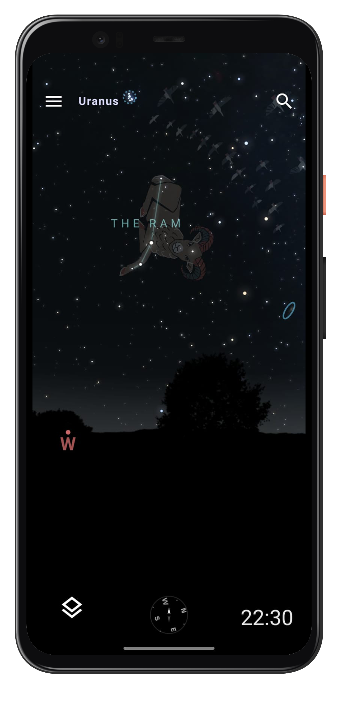

### 4.2 Bottom Bar Layout

The bottom bar has three sections:

| Section | Element | Function |
|---------|---------|----------|
| **Left** | Menu Button | Opens the display settings panel |
| **Center** | Compass | Tap to activate gyroscope mode |
| **Right** | Time Display | Tap to access time control and calendar |

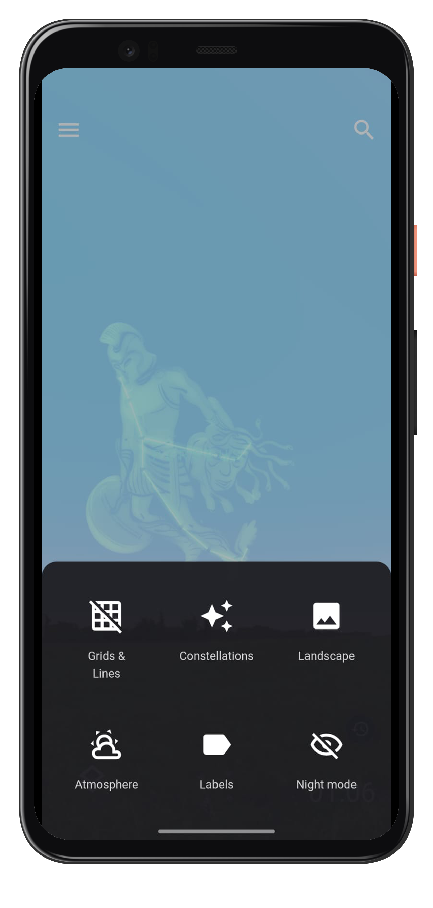

### 4.3 Menu Panel

Tap the menu button (layers icon) to open the settings panel with these options:

| Option | Tap | Long Press |
|--------|-----|------------|
| **Grids & Lines** | Toggle grid overlays | Open grid settings submenu |
| **Constellations** | Toggle constellation lines/art | Open constellation settings |
| **Landscape** | Toggle ground/horizon display | Open landscape selection |
| **Atmosphere** | Toggle sky color simulation | Open atmosphere settings |
| **Labels** | Toggle object labels | Open label settings |
| **Night Mode** | Toggle red tint for night vision | - |

### 4.4 Information Panel

When you select a celestial object, an information panel appears:

```
┌─────────────────────────────────────────────────────────────────┐
│                        SIRIUS                                   │
│                    Alpha Canis Majoris                          │
├─────────────────────────────────────────────────────────────────┤
│  Type:        Star                                              │
│  Magnitude:   -1.46 (Brightest star)                            │
│  Distance:    8.6 light years                                   │
│  RA/Dec:      06h 45m / -16° 43'                                │
│  Altitude:    45° 23'                                           │
│  Azimuth:     180° 15' (South)                                  │
├─────────────────────────────────────────────────────────────────┤
│  [Center View]    [Track Object]    [Add Favorite]              │
└─────────────────────────────────────────────────────────────────┘
```

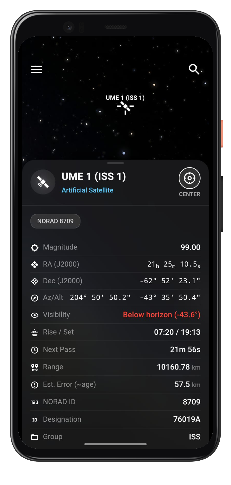

---

## 5. Core Features

### 5.1 Gyroscope Mode

Gyroscope mode uses your device's sensors to display the sky region you're pointing at.

**Enable Gyroscope Mode:**
1. Tap the compass icon (🧭) in the bottom bar
2. Hold your device flat briefly for calibration
3. Point towards the sky
4. The view updates in real-time

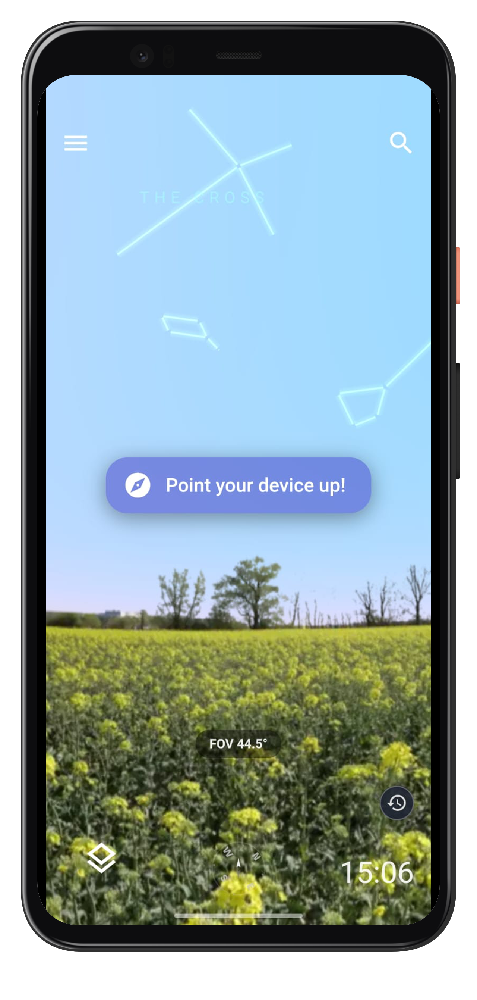

### 5.2 Augmented Reality (AR) Mode

AR mode overlays constellation lines and labels on your camera feed.

**Enable AR Mode:**
1. Tap the camera icon (📷) in the bottom bar
2. Grant camera permission if prompted
3. Point camera at the sky
4. Stars and labels appear overlaid on the live feed

**AR Controls:**
- **Transparency**: Adjust overlay opacity in settings
- **Labels**: Toggle star names on/off
- **Lines**: Toggle constellation lines

### 5.3 Constellation Display

Toggle constellation visualizations:

| Mode | Description |
|------|-------------|
| **Lines** | Connect stars with lines |
| **Art** | Display mythology artwork |
| **Boundaries** | Show constellation boundaries |
| **Labels** | Show constellation names |


**Change Sky Culture:**
1. Open Settings (⚙️)
2. Tap "Sky Culture"
3. Select from:
   - IAU (International Astronomical Union)
   - Indian Traditional
   - Chinese
   - Arabic
   - And more...

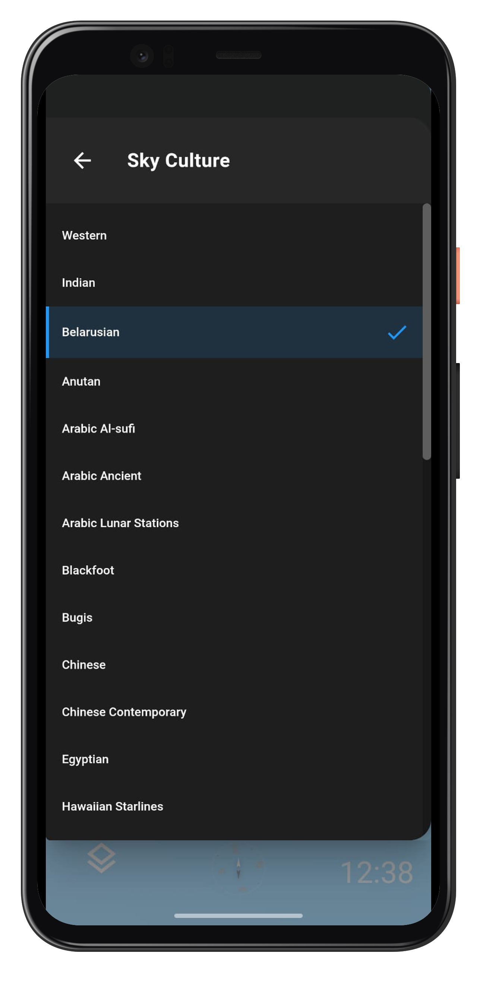

### 5.4 Time Control

Astara can simulate the sky at any date and time.

**Access Time Controls:**
1. Tap the time display at top of screen
2. Use date/time picker to select
3. Or tap Quick buttons:
   - **Now**: Return to current time
   - **Sunrise/Sunset**: Jump to these events
   - **+1 Hour/-1 Hour**: Step through time

**Time Animation:**
- Tap play button to animate sky motion
- Adjust speed between -10000x and 10000x

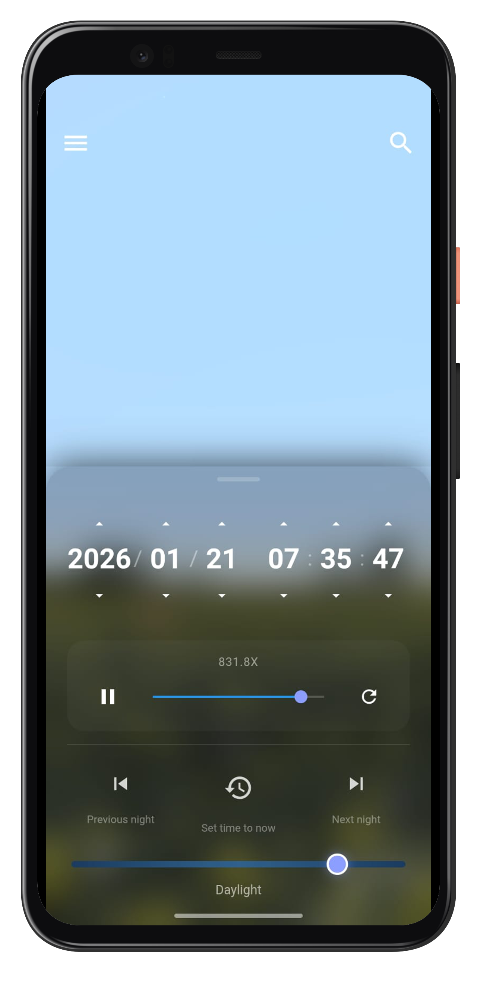

### 5.5 Location Settings

**Automatic Location:**
1. Ensure GPS is enabled
2. Open Settings > Location
3. Tap "Use Autolocation"

**Manual Location:**
1. Open Settings > Location
2. Enter coordinates manually:
   - Latitude: e.g., 28.6139
   - Longitude: e.g., 77.2090
3. Or search by city name

**Saved Locations:**
- Save frequently used locations
- Quick switch between observing sites

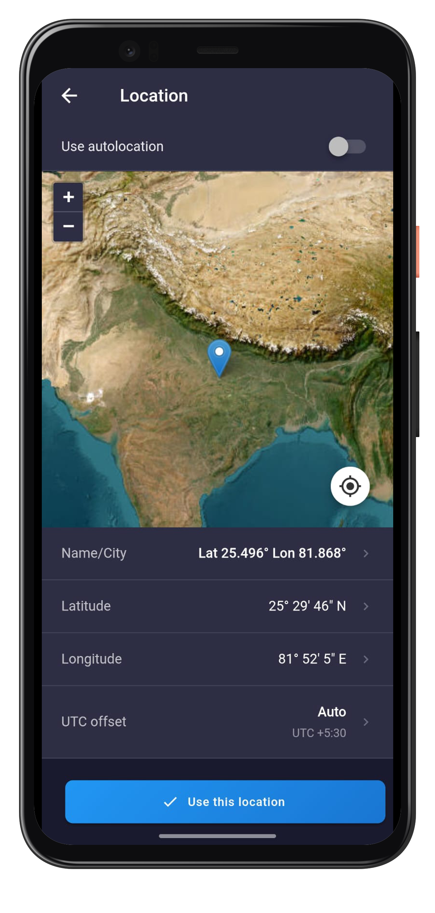

---

## 6. Search and Navigation

### 6.1 Search Panel

Tap the search icon (🔍) to open the search panel.

**Search by Name:**
1. Type object name (e.g., "Orion", "Mars", "M31")
2. Results appear as you type
3. Tap result to center view on object

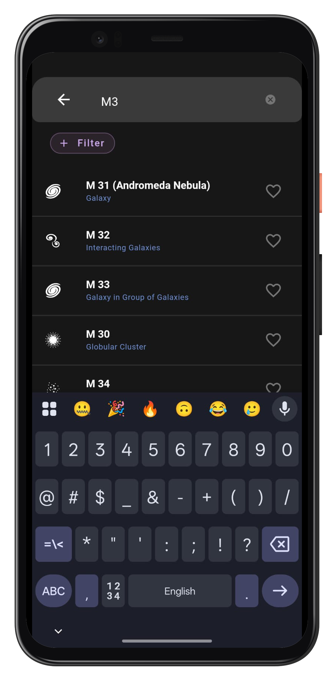

**Search Categories:**

| Category | Examples |
|----------|----------|
| **Constellations** | Orion, Ursa Major, Scorpius |
| **Stars** | Sirius, Vega, Polaris, HIP 12345 |
| **Planets** | Mars, Jupiter, Saturn |
| **DSOs** | M31, NGC 224, Andromeda Galaxy |
| **Satellites** | ISS, Hubble |

### 6.2 Direction Indicator

When tracking an object not in view:

1. Select any object
2. If object is below horizon or out of view
3. An arrow indicator shows direction to object
4. Follow arrow to locate object in sky

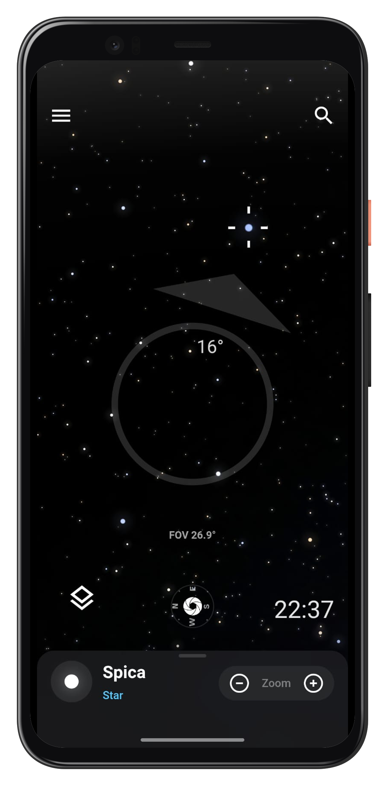

### 6.3 Favorites and Recent

**Add to Favorites:**
1. Select an object
2. Tap "Add Favorite" (⭐)
3. Object saved for quick access

**View Favorites/Recent:**
1. Open Search panel
2. Tap "Favorites" or "Recent" tab
3. Tap any item to navigate

---

## 7. Settings and Configuration

### 7.1 Display Settings

Access via Settings (⚙️) > Display:

| Setting | Options |
|---------|---------|
| **Stars** | Show/Hide, Limit magnitude |
| **Star Names** | Show/Hide, Limit by magnitude |
| **Planets** | Show/Hide, Show labels |
| **DSOs** | Show/Hide, Show markers |
| **Atmosphere** | Enable/Disable sky color simulation |
| **Milky Way** | Show/Hide galactic band |
| **Grid Lines** | Equatorial, Azimuthal, Off |

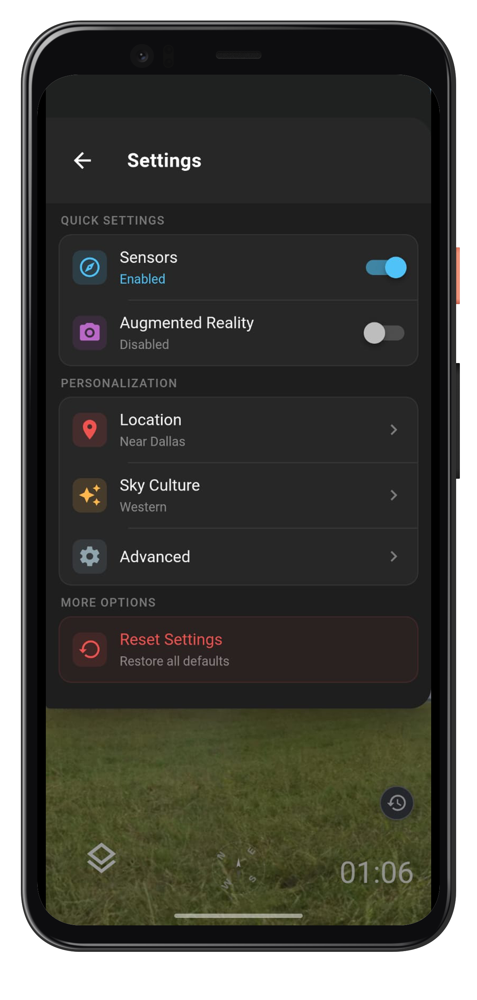

### 7.2 Star Rendering

| Setting | Description |
|---------|-------------|
| **Limiting Magnitude** | Faintest stars shown (default: 6.5) |
| **Twinkling** | Star scintillation effect |
| **Colored Stars** | Show star colors based on temperature |
| **Size Scaling** | Relative star sizes |

### 7.3 Light Pollution

Simulate different observing conditions:

| Bortle Scale | Description |
|--------------|-------------|
| 1 | Excellent dark site |
| 4 | Rural/suburban transition |
| 6 | Bright suburban |
| 8-9 | City center |

### 7.4 Sensor Settings

| Setting | Description |
|---------|-------------|
| **Sensitivity** | Gyroscope response speed |
| **Smoothing** | Reduce jitter |
| **Auto-Calibrate** | Periodic recalibration |
| **Compass Mode** | Use compass with gyro |

---

## 8. Astronomical Calendar

### 8.1 Calendar Panel

Tap the calendar icon (📅) to view astronomical events.

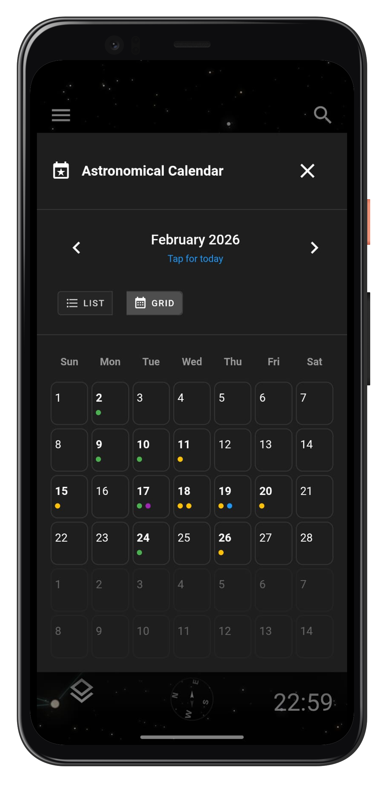

**Event Types:**

| Event | Icon | Description |
|-------|------|-------------|
| **Moon Phases** | 🌙 | New, First Quarter, Full, Last Quarter |
| **Eclipses** | 🌑 | Solar and Lunar eclipses |
| **Conjunctions** | ⚫ | Planet meetups |
| **Planet Events** | 🪐 | Opposition, Greatest Elongation |

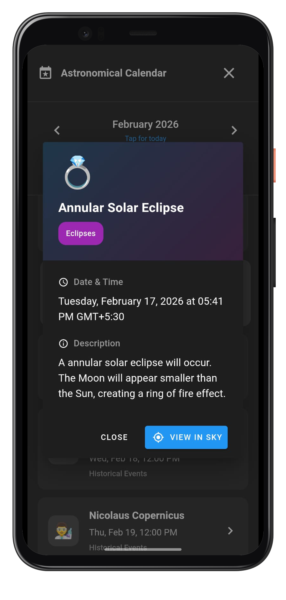

### 8.2 Filtering Events

1. Open Calendar panel
2. Tap filter icon
3. Select event types to show
4. Apply filter

### 8.3 Event Details

Tap any event to see:
- Date and time
- Visibility from your location
- Description
- Observing tips

---

## 9. Advanced Features

### 9.1 Deep Sky Object (DSO) Overlays

View high-resolution images of DSOs:

1. Search for a DSO (e.g., "M42")
2. Zoom in closely
3. HiPS image overlay appears automatically
4. Pinch to zoom into detailed structure

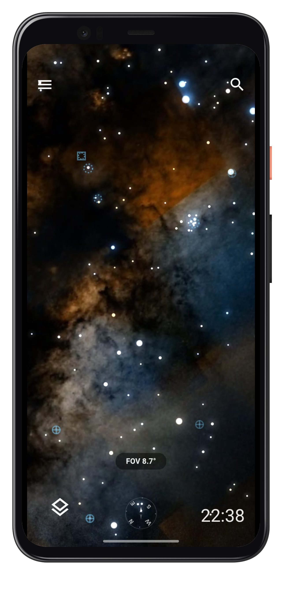

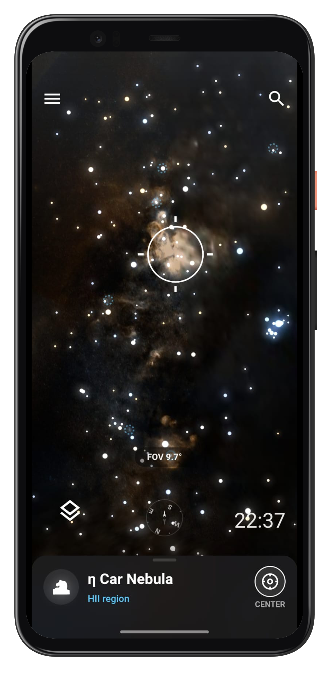

### 9.2 Satellite Tracking

**View Satellites:**
1. Settings > Objects > Satellites
2. Enable satellite display
3. Satellites appear as moving dots

**Track ISS:**
1. Search "ISS"
2. Tap to select
3. View next visible pass times
4. Track in real-time during pass


### 9.3 Advanced Settings

1. Settings > Advanced
2. Adjust slider for desired touch sensitivity
3. Toggle invert Y-axis for manual panning mode
4. Adjust gyroscope and AR settings


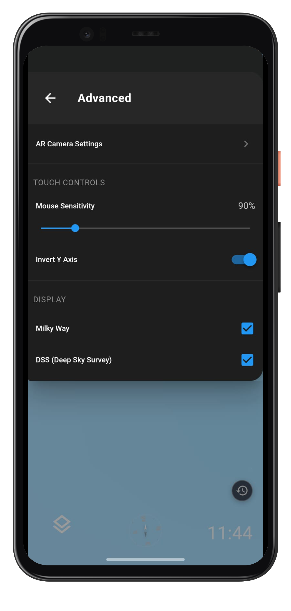